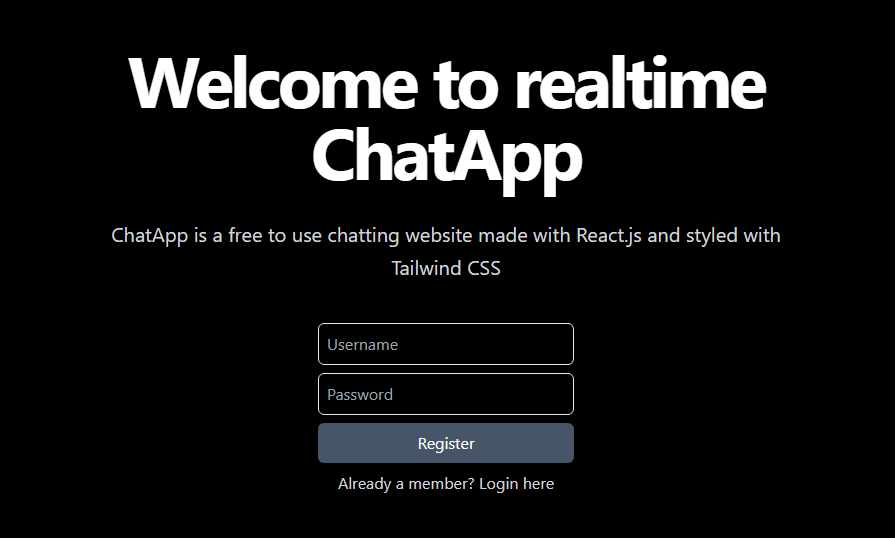

# Chat App💬

Chat App using MERN stack



## Installation

Clone the repo

```bash
  git clone https://github.com/Prathamesh1734/mern-chat-app
  cd mern-chat-app
```

Install npm packages in backend and frontend

```bash
cd backend
npm i
```

```bash
cd frontend
npm i
```

Enter your MongoDB URL in `.env`

```bash
MONGO_URL="your_mongodb_url"
```

## Tech Stack

**Client:** React, TailwindCSS

**Server:** Node, Express, WebSockets
